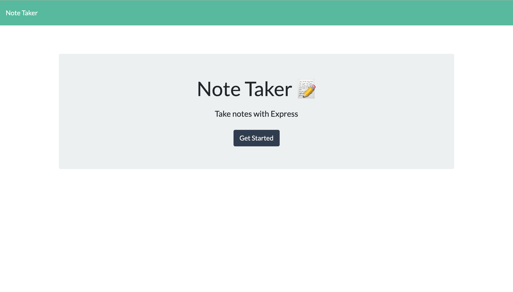
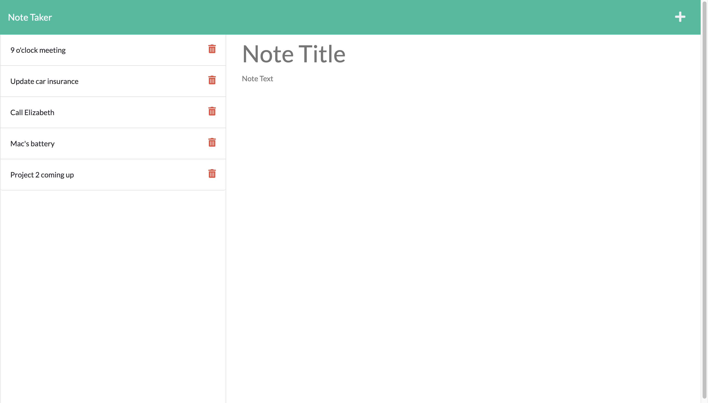

# Note Taker

[Click Here for Deployed Link](https://iqbalahmadi.github.io/Note-Taker/)

## Description 📜

This is a note taking application that provides you with a window where you can add note that contains a title and text. Also you will be able to save it. This application also give you the benefit of deleting a note already saved.

# Table of Contents

- [Technology](#technology)
- [Usage](#usage)
- [Features](#features)
- [License](#license)
- [Contribution](#contribution)
- [Questions](#questions)

# Business Context

- For users that need to keep track of a lot of information, it's easy to forget or be unable to recall something important.

- Being able to take persistent notes allows users to have written information available when needed.

# Application Preview

| Main Page                                        | Saved Notes                                         | Delete Note                                         |
| ------------------------------------------------ | --------------------------------------------------- | --------------------------------------------------- |
|  |  |  |

# Technology

**1. [Express.js](https://expressjs.com/)** :

- Web Applications : Express is a minimal and flexible Node.js web application framework that provides a robust set of features for web and mobile applications.

- APIs : With a myriad of HTTP utility methods and middleware, creating a robust API is quick and easy.

- Performance : Express provides a thin layer of fundamental web application features, without obscuring Node.js features.

**2. [Node.js](https://nodejs.org/en/)** :

- Node.js is an open-source and cross-platform JavaScript runtime environment.

- A Node.js app is run in a single process, without creating a new thread for every request.

- Node.js provides a set of asynchronous I/O primitives in its standard library that prevent JavaScript code from blocking.

# Usage

- Clone this repository to use this application on local machine.

- To install necessary dependencies, run the following command :

```
npm i
```

- The application will be invoked with the following command: This will start localhost server on PORT 3000.

```
node server.js
```

- Open browser and type `http://localhost:3000/` to run this application on your local machine.

# Features :

1. Used 'Express.js' to build server

2. Used 'fs(File System)' module to read and write from 'db.json' file.

3. Application is deployed on [heroku](https://www.heroku.com/) : Heroku is a container-based cloud Platform as a Service (PaaS). Developers use Heroku to deploy, manage, and scale modern apps.

# License

This project is licensed under MIT license.

# Contribution

Pull requests are always welcome!

# Questions

If you have any questions about the repo,
[open an issue](https://github.com/IqbalAhmadi/Note-Taker/issues)
or contact me directly at [Email](mailto:iqb.ahmadi@gmail.com).
